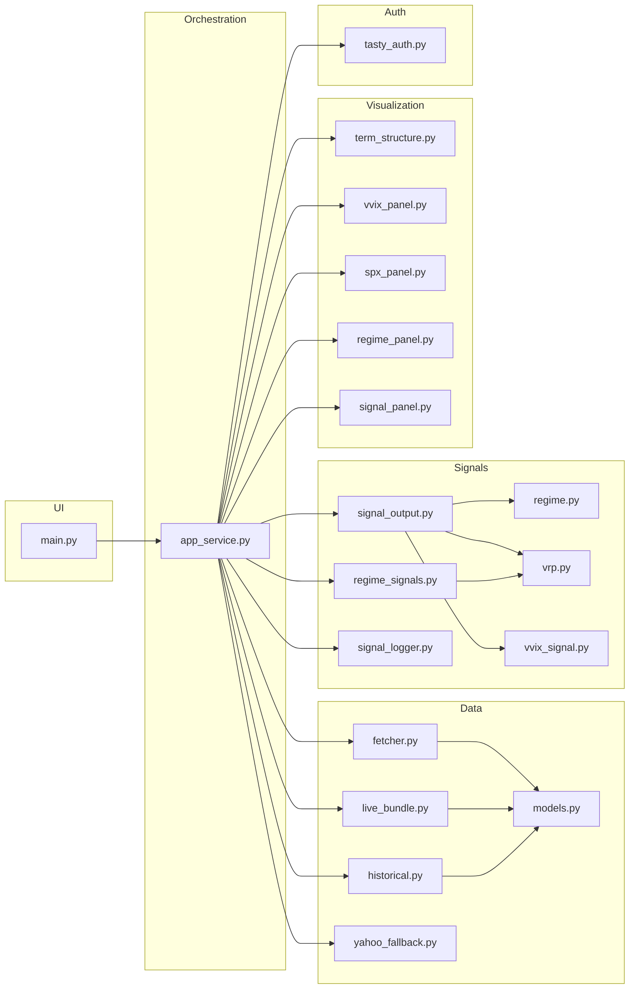

# VIX dashboard

A small **Plotly Dash** app that shows **VIX term structure**, **VVIX** context, and simple **regime / signal** summaries using the [Tastytrade](https://developer.tastytrade.com/) API for live data, with **Yahoo Finance** (via `yfinance`) for daily index history when REST candles are unavailable.

## Project framework

The app is split so **Dash UI** (`main.py`) stays thin: a timer callback calls **`refresh_dashboard`** in `app_service.py`, which chains **auth → REST fetch → historical panel → domain models → signal math → Plotly figures and HTML**. Configuration and tuning constants live in `config.py` (`AppConfig`, `THRESHOLDS`).



### Package layout

| Area | Role |
|------|------|
| **`main.py`** | Builds Dash layout, `dcc.Interval` refresh, wires callbacks to `refresh_dashboard`. |
| **`launcher.py`** | Convenience: runs `python -m vix_dashboard.main` from the correct working directory and opens the browser (expects the package folder to be named `vix_dashboard` under `PYTHONPATH`). |
| **`app_service.py`** | **`refresh_dashboard`**: end-to-end tick—quotes, term structure, daily panel, live `Signal`, composite regime `DataFrame`, figures, alert banner, and logging hooks. Helpers: **`_auth_optional`**, **`_spot_vix`**, **`_vix_sparkline_aligned`**, **`_live_signal_div`**, **`_fmt_2dp`**. |
| **`config.py`** | **`load_config`**, **`oauth_credentials`**, dataclasses for API, symbols, regime/VVIX/VRP/dash/CSV settings; **`THRESHOLDS`** for composite score bands and signal flags. |
| **`auth/tasty_auth.py`** | **`TastyAuth`**: OAuth2 refresh-token session; **`safe_request`** for authenticated REST calls. |
| **`data/fetcher.py`** | **`list_vx_futures`**, **`fetch_quotes_by_type`** (indices + futures quotes). |
| **`data/live_bundle.py`** | **`build_term_structure`**: front-month VX prices + spot → `TermStructure` and term-structure regime via `signals.regime`. |
| **`data/historical.py`** | **`CsvHistoricalProvider`**, **`TastyHistoricalProvider`**, **`ChainedHistoricalProvider.get_daily_panel`**: merged daily panel (VIX, VVIX, SPX, VX columns) with optional CSV overlay. |
| **`data/yahoo_fallback.py`** | **`fetch_index_closes`**, **`fetch_vvix_sparkline`**, **`yahoo_ticker_for_index`** when history or short VVIX series must come from Yahoo. |
| **`data/models.py`** | Domain types: **`Regime`**, **`TermStructure`**, **`VVIXReading`**, **`Signal`**, **`DataHealth`**, **`QuoteSnapshot`**, **`FuturesContract`**, **`Candle`**. |
| **`signals/regime.py`** | **`classify_regime`**, **`contango_fraction`** from front two futures (thresholds in `RegimeConfig`). |
| **`signals/vrp.py`** | **`compute_hv20`**, **`compute_vrp`** (VIX vs realized vol). |
| **`signals/vvix_signal.py`** | **`compute_vvix_features`**, **`features_to_reading`** → `VVIXReading`. |
| **`signals/signal_output.py`** | **`build_live_signal`**: combines `TermStructure`, VVIX/SPX series into one **`Signal`** for the “Live signal” panel. |
| **`signals/regime_signals.py`** | Daily panel analytics: **`compute_regime_signals`** (composite score, flags, columns for history), **`regime_label_from_score`**, **`rolling_min_max_norm`**, **`score_crossing_events`**, **`signal_row_statuses`** for the component table. |
| **`signals/signal_logger.py`** | Side effects: **`init_signal_db`**, **`append_daily_signal_log`**, **`process_threshold_crossings`**, **`update_forward_returns`**, **`build_log_snapshot`**, etc. Writes **`regime_signal_log.csv`**, **`threshold_crossings.csv`**, and **`regime_signals.db`** beside the package. |
| **`viz/term_structure.py`** | **`make_term_structure_figure`**. |
| **`viz/vvix_panel.py`** | **`make_vvix_figure`** (VVIX + optional sparklines). |
| **`viz/spx_panel.py`** | **`make_spx_figure`**. |
| **`viz/regime_panel.py`** | **`make_regime_gauge_block`**, **`make_signal_component_table`**, **`make_regime_history_figure`**, **`make_alert_banner`**. |
| **`viz/signal_panel.py`** | **`make_health_banner`** from `DataHealth` messages. |

### Function breakdown (by concern)

- **Live market data**: OAuth (`TastyAuth`) → list VX contracts and batch quotes (`fetcher`) → `build_term_structure` classifies contango/backwardation (`regime`).
- **Historical context**: `ChainedHistoricalProvider` builds a daily panel; gaps may be filled from **`VIX_PANEL_CSV`** (`CsvHistoricalProvider`). Yahoo fills missing index/sparkline pieces (`yahoo_fallback`).
- **“Live signal” strip**: `build_live_signal` merges term structure, VVIX features, HV20/VRP (`vrp`, `vvix_signal`) into `Signal`.
- **Regime dashboard (gauge, table, history)**: `compute_regime_signals` on the full panel → gauge/table/history figures (`regime_panel`); alerts when early-warning / slope / correlation flags fire.
- **Persistence**: each refresh can append to CSV/SQLite via `signal_logger` (failures are logged, not fatal to the UI).

## Requirements

- **Python 3.10+** (3.11+ recommended)
- A [Tastytrade](https://tastytrade.com/) account and OAuth **application** credentials (client secret + refresh token) for live quotes and chain data

## Install

Clone or download this repository, then from your environment:

```bash
pip install -r requirements.txt
```

The package expects to be importable as `vix_dashboard`. Typical layout:

```text
your-workspace/
  vix_dashboard/          # this repository (the Python package)
    __init__.py
    main.py
    config.py
    ...
```

Add the **parent** of the `vix_dashboard` folder to `PYTHONPATH`, or run commands with that parent as the current working directory (see below).

## Configuration

1. Copy `.env.example` to `.env` inside the `vix_dashboard` package directory (next to `config.py`).
2. Set **required** variables for live API access:

| Variable       | Purpose                                      |
|----------------|----------------------------------------------|
| `TT_SECRET`    | OAuth client secret from Tastytrade          |
| `TT_REFRESH`   | OAuth refresh token                          |

Optional: `TT_API_VERSION`, `TT_USER_AGENT`, and `VIX_PANEL_CSV` (offline panel CSV). See `.env.example` for details.

## Run

From the directory that **contains** the `vix_dashboard` package (the parent of `vix_dashboard/`):

```bash
# Windows PowerShell example — adjust the path
cd path\to\parent
set PYTHONPATH=%CD%
python -m vix_dashboard.main
```

Or on macOS/Linux:

```bash
cd /path/to/parent
export PYTHONPATH="$PWD"
python -m vix_dashboard.main
```

The app serves at **http://127.0.0.1:8050/** by default.

Alternatively, from the same parent directory:

```bash
python path/to/vix_dashboard/launcher.py
```

That starts the app and opens your default browser.

## Security and privacy

- Treat `TT_SECRET` and `TT_REFRESH` like passwords; **never** commit `.env` (it is gitignored).
- The dev server is intended for **local use** (`127.0.0.1`). Do not expose it on the public internet without authentication, TLS, and `debug=False` in production settings.
- Historical index data may be fetched from **Yahoo Finance** when Tastytrade REST history is unavailable.

## Disclaimer

This is an educational / personal tooling project. It is **not** financial advice. Market data may be delayed or inaccurate. Use at your own risk.
